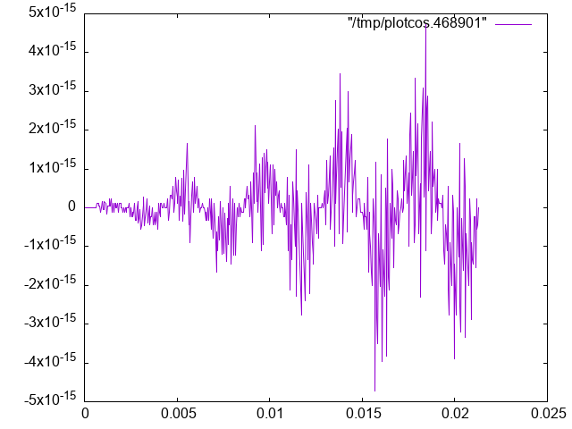

# fftfreq-issue
Bart Massey 2024-04-09

Here's some code I wrote while getting confused about
`endpoint` in `numpy.linspace`.

## Code

* `cos.py` compares the time-domain generation `y0` and
  FFT-based generation `y` of a cosine wave. See the code
  for details.

* `plotcos.sh` can be used to invoke `gnuplot` to show the
  differences graphically.

* `tinycos.py` is a small reproducer published with the
  issue report.

## Plots

This plot shows the difference `y0 - y` for default
arguments.

## Usage

Run `python3 cos.py` to get the maximum absolute error
between `y0` and `y`.

For a graphical view, use `sh plotcos.sh`.  Use `sh
plotcos.sh --png` to get `plot.png`.

Other arguments to these programs allow changing the target
frequency, the sample rate, and the window size. Use
`python3 cos.py --help` or see the source.
